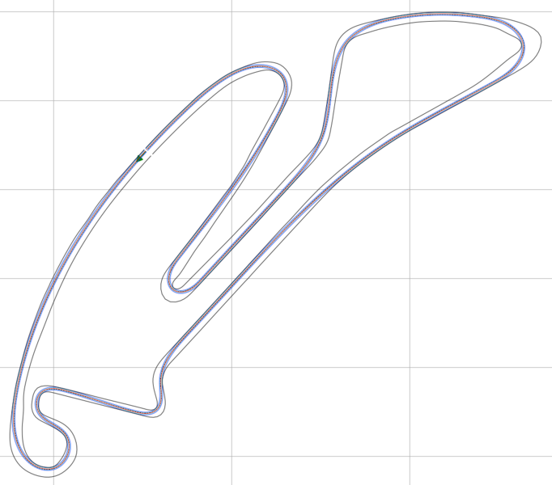

# Python version
Our code is tested with Python 3.5.2

# List of components
* `frictionmap`: This package contains the functions related to the creation and handling of friction maps along the
race track.
* `helper_funcs_glob`: This package contains some helper functions used in several other functions when 
calculating the global race trajectory.
* `inputs`: This folder contains the vehicle dynamics information, the reference track csvs and friction maps.
* `opt_mintime_traj`: This package contains the functions required to find the time-optimal trajectory.
* `params`: This folder contains a parameter file with optimization and vehicle parameters.

# Trajectory Planning Helpers repository
Lots of the required functions for trajectory planning are cumulated in our trajectory planning helpers repository. It
can be found on https://github.com/TUMFTM/trajectory_planning_helpers. They can be quite useful for other projects as well.

# Dependencies
Use the provided `requirements.txt` in the root directory of this repo, in order to install all required modules.\
`pip3 install -r /path/to/requirements.txt`

# Creating your own friction map
The script `main_gen_frictionmap.py` can be used to create your own friction map for any race track file supplied in the
input folder. The resulting maps are stored in the `inputs/frictionmaps` folder. These friction maps can be used within
the minimum time optimization. In principle, they can also be considered within the velocity profile calculation of the
minimum curvature planner. However, this is currently not supported from our side.

# Running the code
* `Step 1:` (optional) Adjust the parameter file that can be found in the `params` folder (required file).
* `Step 2:` (optional) Adjust the ggv diagram and ax_max_machines files in `inputs/veh_dyn_info` (if used).
* `Step 3:` (optional) Add your own reference track file in `inputs/tracks` (required file).
* `Step 4:` (optional) Add your own friction map files in `inputs/frictionmaps` (if used).
* `Step 5:` Adjust the parameters in the upper part of `main_globaltraj.py` and execute it to start the trajectory 
generation process. The calculated race trajectory is stored in `outputs/traj_race_cl.csv`.

IMPORTANT: For further information on the minimum time optimization have a look into the according `Readme.md` which can be
found in the `opt_mintime_traj` folder!

# Wording and conventions
We tried to keep a consistant wording for the variable names:
* path -> [x, y] Describes any array containing x,y coordinates of points (i.e. point coordinates).\
* refline -> [x, y] A path that is used as reference line during our calculations.\
* reftrack -> [x, y, w_tr_right, w_tr_left] An array that contains not only the reference line information but also right
and left track widths. In our case it contains the race track that is used as a basis for the raceline optimization.

Normal vectors usually point to the right in the direction of driving. Therefore, we get the track boundaries by
multiplication as follows: norm_vector * w_tr_right, -norm_vector * w_tr_left.

# Trajectory interface definition
The output csv contains the global race trajectory. The array is of size
[no_points x 7] where no_points depends on stepsize and track length. The seven columns are structured as follows:

* `s_m`: float32, meter. Curvi-linear distance along the raceline.
* `x_m`: float32, meter. X-coordinate of raceline point.
* `y_m`: float32, meter. Y-coordinate of raceline point.
* `psi_rad`: float32, rad. Heading of raceline in current point from -pi to +pi rad. Zero is north (along y-axis).
* `kappa_radpm`: float32, rad/meter. Curvature of raceline in current point.
* `vx_mps`: float32, meter/second. Target velocity in current point.
* `ax_mps2`: float32, meter/second². Target acceleration in current point. We assume this acceleration to be constant
from current point until next point.

# References
* Minimum Curvature Trajectory Planning\
Heilmeier, Wischnewski, Hermansdorfer, Betz, Lienkamp, Lohmann\
Minimum Curvature Trajectory Planning and Control for an Autonomous Racecar\
DOI: 10.1080/00423114.2019.1631455\
Contact person: [Alexander Heilmeier](mailto:alexander.heilmeier@tum.de).

* Time-Optimal Trajectory Planning\
Christ, Wischnewski, Heilmeier, Lohmann\
Time-Optimal Trajectory Planning for a Race Car Considering Variable Tire-Road Friction Coefficients\
DOI: 10.1080/00423114.2019.1704804\
Contact person: [Fabian Christ](mailto:fabian.christ@tum.de).
