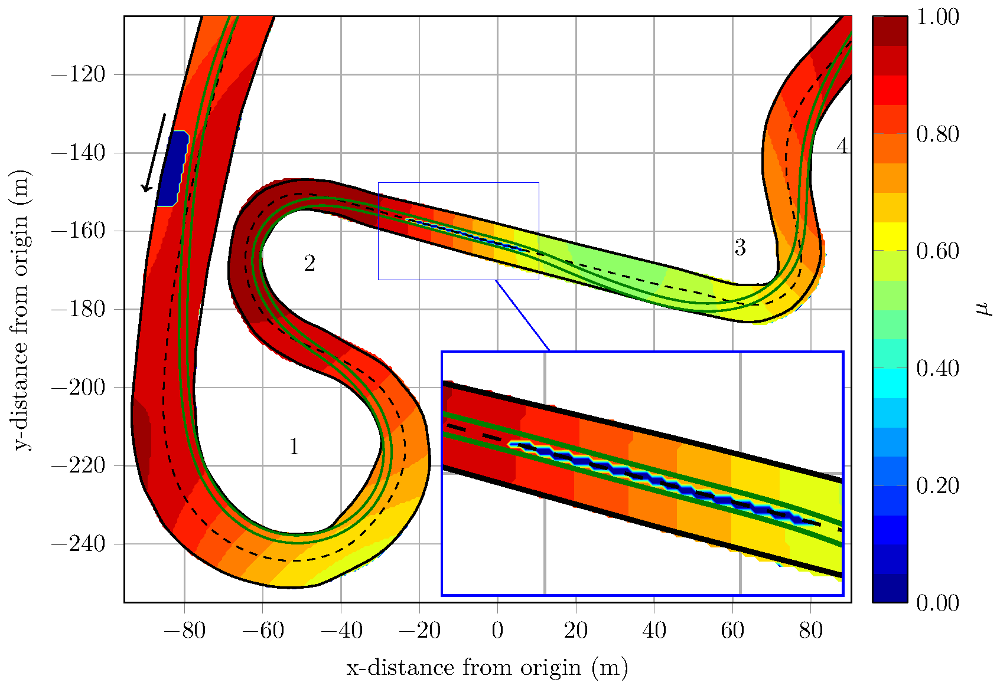

# Time-Optimal Trajectory Planning
This python module shows the planning of time-optimal trajectories, which allows an autonomous race car to drive at
the handling limits, taking into account locally changing road friction values.

For this purpose, the minimum lap time problem is described as an optimal control problem,
converted to a nonlinear program using direct orthogonal Gauss-Legendre collocation and then solved by the
interior-point method IPOPT. Reduced computing times are achieved using a curvilinear abscissa approach for track
description, algorithmic differentiation using the software framework CasADi, and a smoothing of the track input data
by approximate spline regression. The vehicles behavior is approximated as a double track model with quasi-steady state
tire load simplification and nonlinear tire model.

The novelty of this work is the consideration of wheel-specific tire-road friction coefficients along the racetrack
using a track friction map. It is shown that variable friction coefficients have a significant impact on the
trajectory, and therefore significantly improve lap times on inhomogenous racetracks.

# File Structure
* `approx_friction_map.py`: This function calculates an approximation of the provided friction map in a format 
which can be taken into accout in the formulation of time-optimal trajectory planning. 
* `export_mintime_solution.py`: This function exports the solution of the optimization to csvs.
* `extract_friction_coeffs.py`: This function extracts a grid of friction coefficients from the friction map along the 
racetrack.
* `friction_map_interface.py`: This class provides an interface to the friction map.
* `friction_map_plot.py`: This function plots a specified friction map.
* `opt_mintime.py`: This function formulates and solves the time-optimal trajectory optimization problem.
* `result_plots_mintime.py`: This function visualizes the solution of the time-optimal trajectory optimization.

# Optimization Options
The following optimization options can be specified in the user input section of `main_globaltraj.py` in the dict 
`mintime_opts`:
* If you set the parameter `use_warm_start = True`, the initial guess of the nonlinear program can be set with the 
solution of a preview optimization. This can decrease the calculation time significantly. The required files 
`w0.csv`, `lam_x0.csv` and `lam_g0.csv` are saved after each optimization in the outputs folder (`outputs/mintime/`).
* A constant friction coefficient `mue` can be used along the racetrack (`var_friction = None`). Alternatively 
variable friction coefficients from a friction value map (located in `inputs/frictionmaps`) can be used. The 
course of these variable friction coefficients along the racetrack can be described for each wheel by linear 
functions (`var_friction = "linear"`) or by linear combinations of gaussian basis functions (`var_friction = "gauss"`).
See below for additional parameters.

The following optimization options can be specified in `db.ini` in the dict `optim_opts_mintime`:
* The car width for optimization is set through `width_opt` and includes the vehicle width and a safety margin.
* The maximal velocity can be limited to `v_max`.
* Penalty terms (`penalty_delta` & `penalty_F`) can be specified in order to increase the smoothness of the control 
trajectories. Too big values lead to a distortion of the original minimum lap time problem.
* Depending on the setting of `var_friction` as described above the friction coefficient handling differs. A constant 
friction coefficient `mue` can be used along the racetrack (`var_friction = null`). Alternatively 
variable friction coefficients from a friction value map (located in `inputs/frictionmaps`) can be used. Therefore
friction values are extracted on the normal vectors of the reference line with an equidistant distance (`dn`). The 
course of these variable friction coefficients along the racetrack can then be described for each wheel by linear 
functions (`var_friction = "linear"`) or by linear combinations of gaussian basis functions (`var_friction = "gauss"`). 
For this purpose the number of gaussian basis functions on each side (`n_gauss`) can be specified. 
* The energy consumption can be limited (`limit_energy = true`) with an upper bound `energy_limit` (kWh per lap).
* Safe trajectories with reduced acceleration potential can be specified (`safe_traj = true`) via acceleration ellipse, 
defined by the acceleration limits `ax_pos_safe`, `ax_neg_safe` and `ay_safe`.
* The parameters for the two-track model can be specified in the variable `vehicle`.
* The parameters for Pacejka's Magic Formula tire model can be specified in in the variable `tire`.

# Possible Failures
* The trajectory planner uses the curvature of the reference line for describing the racetrack. A smooth course of the 
curvature and its derivative speeds up the optimization and prevents the solution from oscillations. Therefore the 
reference line of the racetrack is preprocessed by an approximate spline regression. It's recommended to check the 
curvature input before starting optimization! If the curvature is not smooth, increase the parameter `s_reg` in the 
`db.ini`.
* If red coloured warnings for warm start functionality appear in the terminal (e.g. WARNING: Failed to load warm start 
files!), please check if the warm start functionality is used (`use_warm_start = True`) without or with the wrong 
warm start files. To bypass this error, just restart the optimization without warm start functionality 
(`use_warm_start = False`). 

# Outputs
* After each optimization the solution for some relevant variables (controls, states, tire forces, time, acceleration
etc.) are saved in the outputs folder (`outputs/mintime/`). These files include the solution of variables with respect
to the independent variable s (curvi-linear distance along the reference line) and the time t.
* If you set the parameter `mintime = True` in `plots_opts` in the `main_globaltraj.py` script, some useful plots appear 
after optimization for visualizing control variables, state variables, tire forces etc.

# Required packages
* `CasADi` for solving the NLP, interfacing IPOPT, calculating derviatives with AD.
* `scipy` & `sklearn` for deriving the description of friction map with linear regession using gaussian basis functions.

# References
Christ, Wischnewski, Heilmeier, Lohmann\
Time-Optimal Trajectory Planning for a Race Car Considering Variable Tire-Road Friction Coefficients\
DOI: 10.1080/00423114.2019.1704804\
Contact person: [Fabian Christ](mailto:fabian.christ@tum.de).
