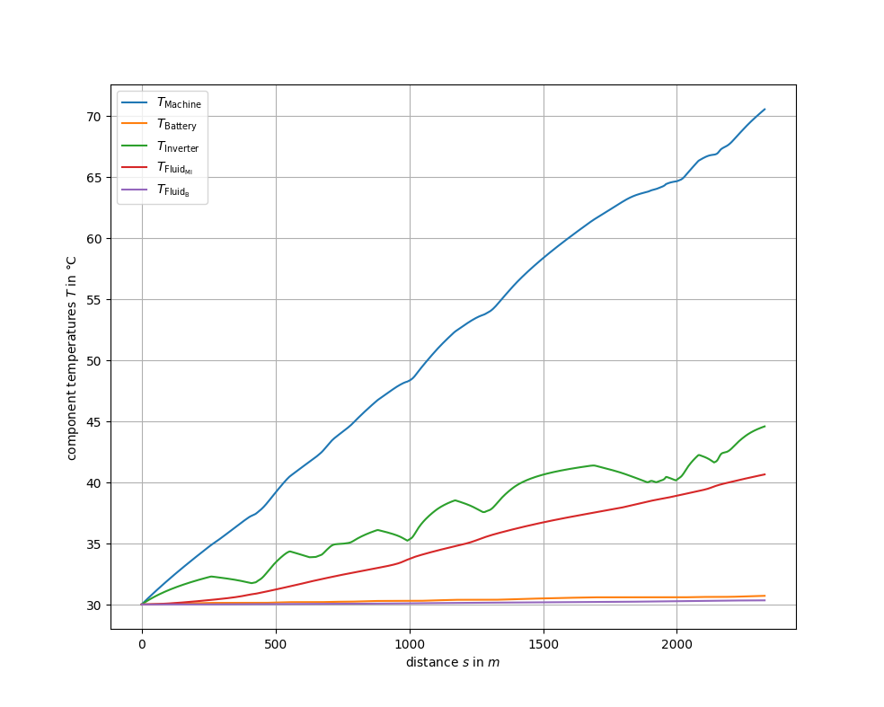
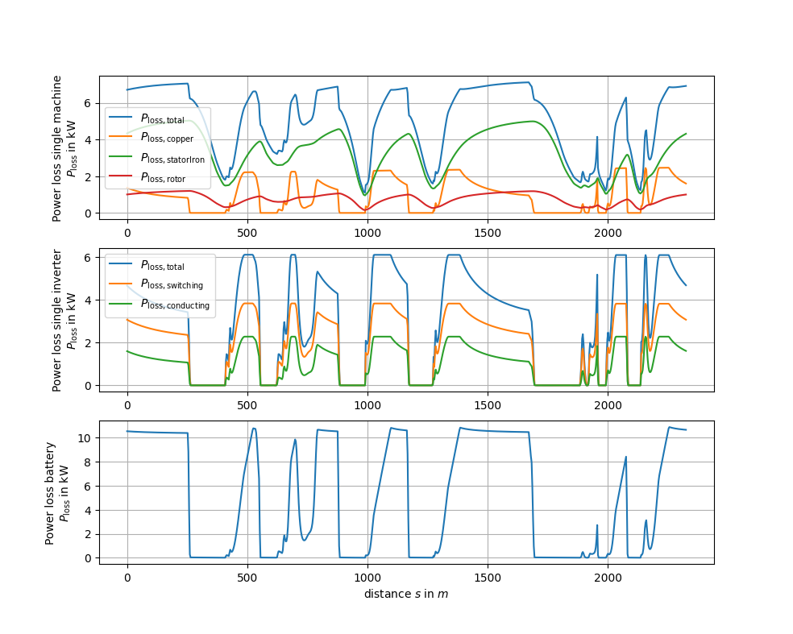

# Powertrain Behavior
By switching on the powertrain behavior as explained in both `Readme.md` files on the top level of this repository and
in the directory `/opt_mintime_traj` you can consider the powertrain behavior (thermal behavior, power losses,
state of charge) during the trajectory optimization. This feature gets especially interesting when dealing with multiple
consecutive race laps, see main `Readme.md` `Step 6`.

By specifying the option `/params/racecar.ini:simple_loss = True`, simple power loss approximations of the 
powertrain components are used. The option `/params/racecar.ini:simple_loss = False` considers a more detailed 
powertrain description.

The results can look like the following plot. It shows the temperatures of the
- electric machines ,
- battery ,
- inverters ,
- cooling liquid for the motor-inverter circuit ,
- cooling liquid for the battery circuit .

The powertrain signals can look like the following two plots, describing the components' temperatures and the 
corresponding power losses, when using the detailed powertrain descriptions:

# References
Powertrain Behavior\
Herrmann, Passigato, Betz, Lienkamp\
Minimum Race-Time Planning-Strategy for an Autonomous Electric Racecar\
DOI: 10.1109/ITSC45102.2020.9294681
Preprint: https://arxiv.org/abs/2005.07127 \
Contact person: [Thomas Herrmann](mailto:thomas.herrmann@tum.de).
